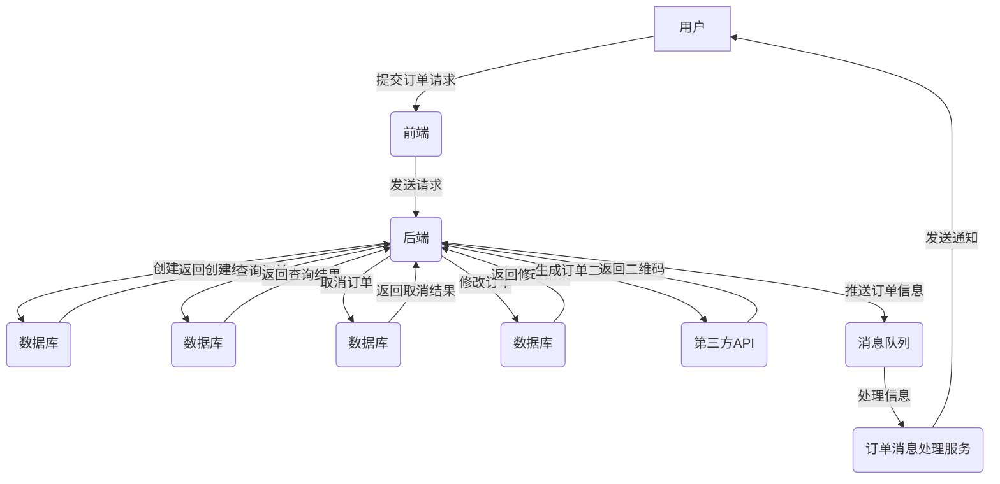

# 管理信息系统02

## 系统分析01

数据字典的作用是对数据流程图上的每个成分给予定义和说明，目的是进行数据分析和归档，同时也是数据库/数据文件设计的依据。

>数据流程图

 ~~~mermaid
graph TD;
    A[客户端]-->B(创建订单请求);
    B-->C[订单服务];
    C-->D[库存服务];
    D-->E{库存是否充足};
    E-->|是|F[订单确认并返回响应];
    E-->|否|G[订单失败并返回响应];
 ~~~

>- A 表示客户端，即订单的创建者。
>- B 表示客户端向订单服务发送创建订单请求。
>- C 表示订单服务，负责处理订单相关的业务逻辑。
>- D 表示库存服务，负责检查订单所需的商品库存是否充足。
>- E 表示库存是否充足的判断条件。
>- F 表示订单确认并返回响应给客户端。
>- G 表示订单创建失败并返回响应给客户端。

系统分析定义了“做什么”的问题，给出了新系统的 **逻辑方案**

数据字典中，用以描述最小的数据组成单位的条目是 **数据元素**

数据字典中，用以描述系统对信息进行处理的逻辑功能的条目是 **数据处理**

数据字典中主要有6类条目:

>  数据元素、数据结构、数据流、数据存储、外部实体和数据处理，不同类型的条目具有不同的属性。

作为系统设计工作的依据和验收目标系统检验标准的报告是 **系统分析报告**

数据流程图由四种基本符号组成，分别是**外部实体**.**数据流**，**数据处理**和**数据存储.**

数据流程图具有**抽象性**和**概括性**，它可以用少量的符号、图形和与此相关的注释来表示系统的逻辑功能，表示所开发的系统在信息处理方面要做什么工作。

使用数据流程图应遵循以下原则(**学习**)

> (1)明确系统边界
> (2)**自顶向下**逐层分解
> (3)在局部上遵循由外向里的原则。

确定新系统的数据流程图和数据字典。

> 前面所做的各项工作实际都是为产生新系统的数据流程图和数据字典做准备。
> 只有通过数据流程图和数据字典，才能把整个系统的各种连接关系描述清楚。它是系统逻辑方案的核心部分。

数据字典中demo

| 数据项       | 数据类型 | 描述                                 |
| ------------ | -------- | ------------------------------------ |
| order_id     | 字符串   | 订单唯一标识符                       |
| user_id      | 字符串   | 用户唯一标识符                       |
| order_time   | 时间戳   | 订单创建时间                         |
| order_status | 字符串   | 订单状态（待支付、已支付、已发货等） |

结构化生命周期法非常强调用户需求定义的正确性。

> 通过对企业管理业务的详细调查，理清原系统的业务流程和管理模式，找出其中的问题和不足，并从功能和数据分析的角度对原系统加以分析与优化，利用**数据流程图**、数据字典和**处理逻辑**的表达方式进行定义，提出新系统的逻辑模型。
>
> 系统分析关键环节，主要解决新系统“做什么”及“应该做什么”的问题，
>
> 系统分析报告主要包括**数据流程图**、数据字典和**处理说明**等。


结构化生命周期

>结构化生命周期法（Structured Life Cycle Methodology）是一种软件开发过程管理方法，强调在软件开发的早期定义明确的需求规格、详细的设计和计划，以及在开发过程中的质量保证和测试，以确保软件开发按计划、高质量地完成。
>
>结构化生命周期法的主要特点包括：
>
>1）明确定义软件开发过程的各个阶段，例如需求定义、设计、编码、测试、维护等；
>
>2）在每个阶段之前进行明确的规划和评审，确保前一阶段完成后才能进入下一阶段；
>
>3）采用结构化的程序设计方法，例如模块化设计、结构化编码等；
>
>4）在软件开发过程中进行质量保证和测试，例如单元测试、集成测试、系统测试等；
>
>5）对软件开发过程进行持续的监控和评估，以确保项目进展顺利、按计划完成。
>
>结构化生命周期法是一种传统的软件开发过程管理方法，被广泛应用于许多大型软件项目。它的优点包括明确的开发过程、规范的文档和交付物、可控的开发成本和进度等。但是，它也存在一些缺点，例如开发周期较长、变更管理困难、适应性差等。随着敏捷开发、DevOps等新兴方法的兴起，结构化生命周期法正在逐渐被取代或改进。


DevOps

>DevOps是一种将软件开发（Dev）和信息技术运维（Ops）整合到一起的文化、工具和流程。它旨在通过打破开发和运维之间的隔阂和沟通，实现快速、高质量的软件交付和运维。DevOps强调自动化、持续集成和交付、代码管理、监控、反馈和改进，使得软件交付的速度和质量得以提高，同时也能更快地响应市场变化和客户需求。
>
>DevOps 好的实践方案，请具体描述一下，最好举个例子
>
>DevOps 的实践方案有很多，具体方案需要根据团队的需求和实际情况进行定制。但是，下面是一些较为通用的 DevOps 实践方案：
>
>1. 持续集成 (Continuous Integration, CI)：自动化地对软件进行编译、构建、测试、部署等操作，以尽早地发现和解决问题。
>2. 持续交付 (Continuous Delivery, CD)：将软件交付流程自动化，实现快速、频繁、可靠地将软件交付到生产环境。
>3. 自动化测试 (Test Automation)：通过自动化测试工具对软件进行各种类型的测试，包括单元测试、集成测试、端到端测试等，以确保软件的质量。
>4. 基础设施自动化 (Infrastructure as Code, IaC)：使用代码来描述基础设施，以便自动化地构建、配置、部署和管理基础设施。
>5. 日志和监控 (Logging and Monitoring)：使用工具对软件进行监控和日志记录，及时发现并解决问题。
>6. 安全和合规性 (Security and Compliance)：将安全和合规性纳入 DevOps 流程中，确保软件的安全性和符合性。
>
>举个例子，以一个电商网站为例，其 DevOps 流程可能如下：
>
>1. 开发人员提交代码到版本控制系统。
>2. 持续集成服务器自动拉取代码，进行编译、构建、测试等操作。
>3. 测试人员在自动化测试环境中对软件进行测试，并将测试结果反馈给开发人员。
>4. 通过持续交付流程，将软件交付到预生产环境中进行部署和测试。
>5. 监控系统实时监控软件运行情况，对出现的问题进行报警和记录。
>6. 通过基础设施自动化工具，自动化地构建、配置、部署和管理基础设施。
>7. 对生产环境中的软件进行安全审计和合规性检查，确保软件的安全性和符合性。


数据流程图分为3个主要层次:

> (1)顶层图。顶层数据流程图是把整个系统看成一个整体，视系统为一个总的数据处理模块.
>
> ~~~mermaid
> graph TD;
>   A[用户] -->|浏览商品| B[商品列表]
>   A -->|查询订单| C[订单列表]
>   A -->|创建订单| D[订单创建]
>   B -->|选择商品| D
>   D -->|提交订单| E[订单提交]
>   E -->|支付订单| F[订单支付]
>   F -->|订单确认| G[订单确认]
> 
> ~~~
>
>
>
> (2)中层图。中层数据流程图是对顶层数据流程图的分解，分解的原则是以系统的模块(子系统)为划分标准
>
>
>
> ```mermaid
> graph TD;
> A(订单模块)-->B(获取订单列表);
> A-->C(创建订单);
> A-->D(修改订单);
> A-->E(删除订单);
> B-->F(查询订单信息);
> ```
>
> (3)底层图。底层数据流程图是对中层数据流程图的进一步分解，是研究子系统内部的数据处理、数据存储、信息流动与交换情况的。




数据分析应从以下几个方面进行 (**学习**)

> (1)围绕系统目标进行分析
> (2)弄清信息源周围的环境
> (3) 围绕现行的业务流程进行分析


系统分析报告主要有以下3个作用。

> (1)描述目标系统的逻辑模型，作为开发人员进行系统设计和实施的基础。
> (2)作为用户和开发人员之间的协议或合同，为双方的交流和监督提供基础
> (3)作为目标系统验收和评价的依据


需求分析可以从信息需求分析、目标分析和**系统范围**界定、系统功能分析及划分等方面展开。

系统分析的目标是要对用户的 **要求**进行定义。

企业信息系统开发中常用的调查方法有研究资料法、开调查会、用户访谈，**问卷**调查法和实地观察法

系统分析中，系统的逻辑方案是新系统开发中要采用的**管理模式**和**信息处理**方法


外部实体

> 指系统以外与系统有联系的人或事物。它们表达该系统数据的外部来源或去处，是外界与本系统有信息关联的部分。


业务流程优化

>业务流程优化是根据系统调查阶段了解到的情况，从业务全过程的角度摸清现状、找出问题的关键点，对业务流程进行彻底的分析和改进。


数据流程图(重点)

>数据流程图是一种便于用户理解、分析系统数据流程的图形工具。它精确地在逻辑上描述了系统的输入、数据处理和数据存储等过程.输出、


## 系统分析02

一个设计好的系统应该有 **较高的扇出系数和较低的扇入系数**

>在软件工程中，扇入系数（Fan-in）是指被调用模块的个数，而扇出系数（Fan-out）是指调用其他模块的个数。一个设计良好的系统通常应该具有较高的扇出系数和较低的扇入系数。
>
>高扇出系数表明模块将功能分解为更小的部分，这有助于提高系统的可维护性和可重用性，因为更小的模块更容易被理解、修改和重用。此外，高扇出系数可以提高系统的性能，因为多个模块并行执行可以加快整个系统的运行速度。
>
>低扇入系数表明每个模块具有相对较少的依赖关系，这可以减少系统中的耦合度。耦合度越低，系统越容易扩展、修改和维护。此外，低扇入系数还可以减少系统的复杂性，因为每个模块的职责更加清晰明确。
>
>因此，设计良好的系统通常应该尽可能地遵循这些原则，以提高系统的可维护性、可重用性、性能和可扩展性。

用户视图是面向用户所呈现出的一种 **虚表**

输出设计的主要工作包括确定输出类型，输出内容，输出方式和**输出格式**

属于系统设计阶段成果的是**系统设计报告**

等各结点通过点到点的通信线路与中心结点连接起来的网络是 **星形网络**

系统设计阶段的、首要考虑的是**系统功能结构设计**

>系统功能结构设计是指在系统设计阶段，根据系统需求分析，将系统功能模块划分并组合成相互独立、协同工作的模块集合的过程。这个过程主要包括两个方面：一方面是将系统的功能拆分成多个模块，每个模块负责一个或多个功能；另一方面是设计模块之间的接口和数据传递方式，以便实现模块间的协同工作。
>
>在进行系统功能结构设计时，需要考虑到系统的功能性、可靠性、易用性、扩展性、维护性等方面的要求。设计的模块要尽可能独立，不同模块之间要避免耦合，以便实现模块的替换和升级。同时，还要考虑模块之间的数据传递方式，确保数据的准确性和及时性，以实现系统的高效工作。

**直接调用该模块的模块**个数被称为 **扇入系数**

独立命名、并且拥有明确定义的实体是 **模块**

系统的吞吐量越大，系统的处理能力 **越强**

>系统的吞吐量（Throughput）指的是在单位时间内处理的请求或事务的数量。这个指标通常用于评估系统的处理能力，即系统可以在多少时间内处理多少请求或事务。吞吐量通常与响应时间和并发用户数等指标一起使用，以评估系统的性能和可伸缩性。吞吐量的提高通常可以通过优化系统的硬件配置、调整系统参数、优化算法等手段来实现。


衡量**系统可靠性**的指标有平均故障时间、平均维护时间、安全保密性和抗病毒能力等

变换型数据流程图是可以明显地分成**输入**、**处理**和**输出**3部分的线型结构

模块结构图又称控制结构图、系统结构图它用一组特殊的图形符号按照一定的规则描述系统的整体结构。模块结构图是结构化**系统设计**的一个主要工具

经验表明，一个设计好的系统应有较高的扇出系数和较低的扇入系数，平均扇入、扇出系数通常是3或4，一般**不应超过7**，否则会引起出错概率的增加

一个模块通过其内部的循环功能来循环调用一个或多个下层模块，则该调用称为**循环调用，用弧形箭头表示**。

一个模块是否调用一个下层模块取决于调用模块内部的判断条件，则该调用称为模块间的**判断调用，采用菱形符号**表示

在模块结构图中，用**连接两个模块的箭头表示调用。**

模块结构图中，表示**数据信息**的箭线是 **带空心圆的小箭头**

在模块结构图中，用**带实心圆的小箭头表示控制信息**，并在旁边标上控制信息名。用带空心圆的小箭头表示数据信息，并在旁边标上数据信息名。

**代码设计**属于系统详细设计

结构化设计方法使用的图形工具是模块结构图 (**学习**)

>结构化设计方法是指在软件开发过程中，将系统的结构按照一定的标准和方法进行设计和构建的过程。它的主要思想是将系统划分为若干个相互独立、有明确功能的模块，以实现高内聚、低耦合的设计目标。在结构化设计方法中，通常采用模块化的设计思路，通过模块之间的接口定义和模块内部的数据流、控制流等关系来描述系统的结构。
>
>结构化设计方法的主要步骤包括：
>
>1.需求分析：了解用户需求、定义系统的功能和性能等方面的要求。
>
>2.系统设计：根据需求分析的结果，对系统进行总体设计，包括定义系统的模块、接口、数据结构等。
>
>3.模块设计：对系统的每个模块进行详细设计，包括模块的功能、数据结构、算法等。
>
>4.编码和测试：根据模块设计的结果，进行编码和测试。
>
>在结构化设计方法中，模块化是非常重要的一个概念。通过模块化的设计，可以将系统分解成若干个相互独立的模块，每个模块具有明确的功能和职责，可以独立开发、测试和维护。同时，模块之间的接口设计也非常重要，它决定了模块之间的耦合程度，直接影响系统的可维护性和扩展性。
>
>在实际的软件开发过程中，结构化设计方法已经成为一种通用的软件设计方法，得到了广泛的应用。

>以下是一个简单的商城系统的模块结构图，其中包括用户模块、商品模块、订单模块、支付模块、通信模块和后台管理模块：
>
>```
>markdownCopy code商城系统
>│
>├── 用户模块
>│   ├── 登录注册
>│   ├── 个人信息管理
>│   └── 购物车管理
>│
>├── 商品模块
>│   ├── 商品展示
>│   ├── 商品搜索
>│   ├── 商品分类
>│   └── 商品详情
>│
>├── 订单模块
>│   ├── 创建订单
>│   ├── 订单支付
>│   ├── 订单查询
>│   └── 订单退款
>│
>├── 支付模块
>│   ├── 支付接口
>│   ├── 支付回调
>│   └── 支付记录
>│
>├── 通信模块
>│   ├── 邮件服务
>│   ├── 短信服务
>│   └── 推送服务
>│
>└── 后台管理模块
>    ├── 商品管理
>    ├── 订单管理
>    ├── 用户管理
>    ├── 营销活动管理
>    └── 数据统计分析
>```
>
>从模块结构图可以看出，商城系统中的各个模块之间是相互关联的，例如：
>
>- 用户模块与商品模块：用户可以浏览商品、搜索商品、查看商品详情、将商品加入购物车等等。
>- 用户模块与订单模块：用户可以创建订单、查询订单、退款等等。
>- 商品模块与订单模块：订单需要包含商品信息，商品也需要记录订单信息。
>- 订单模块与支付模块：订单需要进行支付，支付成功后需要更新订单状态等等。
>- 后台管理模块与其他模块：后台管理员需要对用户、商品、订单等进行管理和监控，同时需要进行数据统计分析来优化商城系统的运营策略。
>
>因此，商城系统的模块之间是相互依存、相互支持的，各模块需要紧密协作才能完成商城系统的全部功能。


在模块结构图中，用连接两个模块的能头表示调用。**模块结构图规定调用关系只能是上层模块调用下层模块**，不允许下层模块调用上层模块，但是可以理解成下层模块执行后又返回到上层模块。因此，调用箭头总是向下，不允许向上。

计算机软件设计:

> (1)操作系统:操作系统是统一管理计算机软、硬件资源的系统软件，在计算机和用户之间起到接口和桥梁的作用
>
> (2)数据库管理系统:信息系统以数据库系统为基础，数据库系统选择是否恰当对信息系统有着举足轻重的影响。
>
> (3)开发工具:开发工具的选择首先依据信息系统的总体结构设计。


在系统设计中，模快结构图和功能结构设计经第用到两种方法，一种方法是规范由数据流程图导出初始模块结构图，另一种方法是系统设计者根据功能等因责直接进行功能结构设计，

模块结构图由**模块**、**调用**，**数据信息**、**控制信息**和转接等基本符号组成

数据库物理结构设计的主要任务就是给 **逻辑** 数据模型选择一种最适合应用要求的物理结构，并进行评价

输入设计的主要工作包括输入内容设计、输入格式设计、输入方式设计、输入 **数据**校验。

模块的4个要素中，把输入转换成输出的要素是 **数据处理**

数据库的完整性保护是保护 **数据结构** 不受损害，保证数据的正确性、有效性和一致性

结构化方法的基本思想就是模块化，

> 即把系统功能**自顶向下地**、由**抽象到具体地**划分为多层次的独立功能模块，每个模块完成一个特定的功能，
> 一直分解到能简单地用程序实现为止。这些模块以某种结构形式组成一个整体，可以完成指定的功能。

言息系统设计可以划分为**逻辑设计**和 **物理设计**两个层面。

从设计任务的角度看，信息系统设计可以划分为**总体性设计**和**详细性设计**。总体和详细是一对具有对应逻辑层次关系。

一个模块的四个要素分别是**输入输出**、**处理功能**、**内部数据**和**程序代码**。


模块的扇出系数

> 就是一个模块直接调用其他模块的个数


系统的响应时间是

>  指从用户向系统发出一个作业请求开始，经系统处理后，给出应答结果的时间.


结构化方法的基本愿想是模块化，

> 即把系统功能自顶向下地、由抽象到具体地划分为多层次的独立功能模央，
>
> 每个块完成一个特定的功能一直分解到简单地用程序实现为上这些懂块以某种结
> 形式组成一个整体，可以完成指定的功能。


系统的香吐量

>  是指系统每秒执行的作业数，这个数值越大证明系统的处理能力越强。


模块的耦台性

>  指多个模块间相互联系、相互依赖的程度，主要从模块外部考察模块的独立性。


模块

>  是指独立命名并且拥有明确定义的实体。系统中任何一个处理功能都可以看成是一个模块。


数据库实施是根据数据库逻设计和物理设的结果，建立实际的数据库结构 装》数摆 进行活和污行的过程，

数据库的污行和维护是指数据库转储和恢复维持数据库的安全性与完整性
监测并改善数据库性能，以及数据库的重组和重构等开发后续工作。


