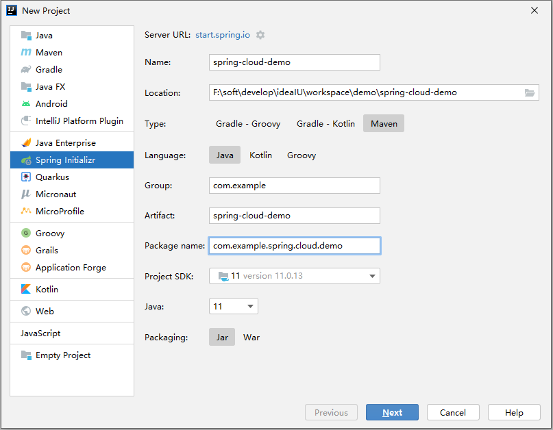
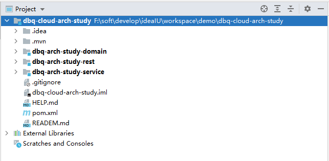

# SpringBoot集成MyBatis搭建基本骨架

> 本文主要讲解mall整合SpringBoot+MyBatis搭建基本骨架，以用户为例实现基本的CRUD操作及通过PageHelper实现分页查询。

## 项目使用框架介绍

### SpringBoot

> SpringBoot可以让你快速构建基于Spring的Web应用程序，内置多种Web容器(如Tomcat)，通过启动入口程序的main函数即可运行。

### PagerHelper

> MyBatis分页插件，简单的几行代码就能实现分页，在与SpringBoot整合时，只要整合了PagerHelper就自动整合了MyBatis。

### Druid
> alibaba开源的数据库连接池，号称Java语言中最好的数据库连接池。

### Mybatis generator

> MyBatis的代码生成器，可以根据数据库生成model、mapper.xml、mapper接口和Example，通常情况下的单表查询不用再手写mapper。

## 项目搭建

### 使用IDEA初始化一个SpringBoot项目




### 项目结构说明



>ps:
>
>domain 对象，dto
>
>rest        对外接口
>
>service   服务层

### 添加项目依赖

> 在主pom文件 配置相关依赖

```xml
<?xml version="1.0" encoding="UTF-8"?>
<project xmlns="http://maven.apache.org/POM/4.0.0" xmlns:xsi="http://www.w3.org/2001/XMLSchema-instance"
         xsi:schemaLocation="http://maven.apache.org/POM/4.0.0 https://maven.apache.org/xsd/maven-4.0.0.xsd">
    <modelVersion>4.0.0</modelVersion>
    <modules>
        <module>dbq-arch-study-domain</module>
        <module>dbq-arch-study-service</module>
        <module>dbq-arch-study-rest</module>
    </modules>

    <parent>
        <groupId>org.springframework.boot</groupId>
        <artifactId>spring-boot-starter-parent</artifactId>
        <version>2.3.2.RELEASE</version>
        <relativePath/> <!-- lookup parent from repository -->
    </parent>

    <groupId>com.dbq</groupId>
    <artifactId>dbq-cloud-arch-study</artifactId>
    <version>0.0.1-SNAPSHOT</version>
    <name>dbq-cloud-arch-study</name>
    <description>Demo project for Spring Boot</description>
    <packaging>pom</packaging>

    <properties>
        <project.build.sourceEncoding>UTF-8</project.build.sourceEncoding>
        <project.reporting.outputEncoding>UTF-8</project.reporting.outputEncoding>
        <project.build.sourceEncoding>UTF-8</project.build.sourceEncoding>
        <java.version>11</java.version>
        <maven.compiler.source>${java.version}</maven.compiler.source>
        <maven.compiler.target>${java.version}</maven.compiler.target>
        <!-- spring.cloud.version  -->
        <spring.cloud.version>Hoxton.SR12</spring.cloud.version>
        <!-- alibaba.cloud.version  -->
        <alibaba.cloud.version>2.2.6.RELEASE</alibaba.cloud.version>
        <!-- maven.plugin.versio-->
        <maven.plugin.version>3.8.1</maven.plugin.version>
        <!-- druid.version -->
        <druid.version>1.2.8</druid.version>
    </properties>

    <dependencyManagement>

        <dependencies>

            <!-- Druid -->
            <dependency>
                <groupId>com.alibaba</groupId>
                <artifactId>druid</artifactId>
                <version>${druid.version}</version>
            </dependency>

            <!-- Druid -->
            <dependency>
                <groupId>com.alibaba</groupId>
                <artifactId>druid-spring-boot-starter</artifactId>
                <version>${druid.version}</version>
            </dependency>

            <!-- mybatis -->
            <dependency>
                <groupId>org.mybatis.spring.boot</groupId>
                <artifactId>mybatis-spring-boot-starter</artifactId>
                <version>2.1.0</version>
            </dependency>

            <!-- mybatis -->
            <dependency>
                <groupId>com.baomidou</groupId>
                <artifactId>mybatis-plus-boot-starter</artifactId>
                <version>3.4.2</version>
            </dependency>

            <!-- pagehelper -->
            <dependency>
                <groupId>com.github.pagehelper</groupId>
                <artifactId>pagehelper-spring-boot-starter</artifactId>
                <version>1.4.1</version>
            </dependency>

            <!-- MyBatis 生成器 -->
            <dependency>
                <groupId>org.mybatis.generator</groupId>
                <artifactId>mybatis-generator-core</artifactId>
                <version>1.3.3</version>
            </dependency>

            <dependency>
                <groupId>com.alibaba</groupId>
                <artifactId>fastjson</artifactId>
                <version>1.2.78</version>
            </dependency>

            <dependency>
                <groupId>org.jsoup</groupId>
                <artifactId>jsoup</artifactId>
                <version>1.12.1</version>
            </dependency>

            <!-- 业务 -->
            <dependency>
                <groupId>com.dbq</groupId>
                <artifactId>dbq-arch-study-domain</artifactId>
                <version>0.0.1-SNAPSHOT</version>
            </dependency>

            <dependency>
                <groupId>com.dbq</groupId>
                <artifactId>dbq-arch-study-service</artifactId>
                <version>0.0.1-SNAPSHOT</version>
            </dependency>

        </dependencies>

    </dependencyManagement>

    <build>
        <plugins>
            <plugin>
                <groupId>org.springframework.boot</groupId>
                <artifactId>spring-boot-maven-plugin</artifactId>
                <configuration>
                    <excludes>
                        <exclude>
                            <groupId>org.projectlombok</groupId>
                            <artifactId>lombok</artifactId>
                        </exclude>
                    </excludes>
                </configuration>
            </plugin>

            <plugin>
                <groupId>org.apache.maven.plugins</groupId>
                <artifactId>maven-compiler-plugin</artifactId>
                <configuration>
                    <source>${java.version}</source>
                    <target>${java.version}</target>
                </configuration>
            </plugin>

            <plugin>
                <groupId>org.apache.maven.plugins</groupId>
                <artifactId>maven-surefire-plugin</artifactId>
                <configuration>
                    <skipTests>true</skipTests>    <!--默认关掉单元测试 -->
                </configuration>
            </plugin>
        </plugins>
    </build>

</project>

```
### service模块generatorCRUD方法

#### Mybatis generator 配置文件

>1.pom配置

~~~xml
<?xml version="1.0" encoding="UTF-8"?>
<project xmlns="http://maven.apache.org/POM/4.0.0"
         xmlns:xsi="http://www.w3.org/2001/XMLSchema-instance"
         xsi:schemaLocation="http://maven.apache.org/POM/4.0.0 http://maven.apache.org/xsd/maven-4.0.0.xsd">
    <parent>
        <artifactId>dbq-cloud-arch-study</artifactId>
        <groupId>com.dbq</groupId>
        <version>0.0.1-SNAPSHOT</version>
    </parent>
    <modelVersion>4.0.0</modelVersion>

    <artifactId>dbq-arch-study-service</artifactId>

    <properties>
        <maven.compiler.source>11</maven.compiler.source>
        <maven.compiler.target>11</maven.compiler.target>
    </properties>

    <dependencies>

        <dependency>
            <groupId>com.dbq</groupId>
            <artifactId>dbq-arch-study-domain</artifactId>
        </dependency>

        <dependency>
            <groupId>junit</groupId>
            <artifactId>junit</artifactId>
        </dependency>

        <!-- MyBatis 生成器 -->
        <dependency>
            <groupId>org.mybatis.generator</groupId>
            <artifactId>mybatis-generator-core</artifactId>
        </dependency>

        <!--Mysql数据库驱动-->
        <dependency>
            <groupId>mysql</groupId>
            <artifactId>mysql-connector-java</artifactId>
        </dependency>

     
        <dependency>
            <groupId>com.github.pagehelper</groupId>
            <artifactId>pagehelper-spring-boot-starter</artifactId>
        </dependency>

        <dependency>
            <groupId>org.springframework.boot</groupId>
            <artifactId>spring-boot-starter-aop</artifactId>
        </dependency>

        <dependency>
            <groupId>org.springframework.boot</groupId>
            <artifactId>spring-boot-starter-test</artifactId>
            <scope>test</scope>
        </dependency>

    </dependencies>

</project>

~~~


> 2.配置数据库连接，Mybatis generator生成model、mapper接口及mapper.xml的路径。

>2.1 generator.properties

~~~properties
jdbc.driverClass=com.mysql.cj.jdbc.Driver
jdbc.connectionURL=jdbc:mysql://localhost:3306/mall?useUnicode=true&characterEncoding=utf-8&useSSL=false
jdbc.userId=root
jdbc.password=root
~~~

>2.2 generatorConfig.xml

```xml
<?xml version="1.0" encoding="UTF-8"?>
<!DOCTYPE generatorConfiguration
        PUBLIC "-//mybatis.org//DTD MyBatis Generator Configuration 1.0//EN"
        "http://mybatis.org/dtd/mybatis-generator-config_1_0.dtd">

<generatorConfiguration>
    <properties resource="generator.properties"/>
    <context id="MySqlContext" targetRuntime="MyBatis3" defaultModelType="flat">
        <property name="beginningDelimiter" value="`"/>
        <property name="endingDelimiter" value="`"/>
        <property name="javaFileEncoding" value="UTF-8"/>
        <!-- 为模型生成序列化方法-->
        <plugin type="org.mybatis.generator.plugins.SerializablePlugin"/>
        <!-- 为生成的Java模型创建一个toString方法 -->
        <plugin type="org.mybatis.generator.plugins.ToStringPlugin"/>
        <!--可以自定义生成model的代码注释 这个方法需要重写-->
        <commentGenerator type="com.dbq.arch.study.generator.CommentGenerator">
            <!-- 是否去除自动生成的注释 true：是 ： false:否 -->
            <property name="suppressAllComments" value="true"/>
            <property name="suppressDate" value="true"/>
            <property name="addRemarkComments" value="true"/>
        </commentGenerator>
        <!--配置数据库连接-->
        <jdbcConnection driverClass="${jdbc.driverClass}"
                        connectionURL="${jdbc.connectionURL}"
                        userId="${jdbc.userId}"
                        password="${jdbc.password}">
            <!--解决mysql驱动升级到8.0后不生成指定数据库代码的问题-->
            <property name="nullCatalogMeansCurrent" value="true" />
        </jdbcConnection>

        <!--指定生成model的路径-->
        <javaModelGenerator targetPackage="com.dbq.arch.study.mall.model" targetProject="F:\soft\develop\ideaIU\workspace\demo\dbq-cloud-arch-study\dbq-arch-study-domain\src\main\java"/>

        <!--指定生成mapper.xml的路径-->
        <sqlMapGenerator targetPackage="mapper" targetProject="F:\soft\develop\ideaIU\workspace\demo\dbq-cloud-arch-study\dbq-arch-study-service\src\main\resources"/>

        <!--指定生成mapper接口的的路径-->
        <javaClientGenerator type="XMLMAPPER" targetPackage="com.dbq.arch.study.mall.mapper" targetProject="F:\soft\develop\ideaIU\workspace\demo\dbq-cloud-arch-study\dbq-arch-study-service\src\main\java"/>

        <!--生成全部表tableName设为%-->
        <table tableName="mall_user">
            <generatedKey column="id" sqlStatement="MySql" identity="true"/>
        </table>

    </context>
</generatorConfiguration>

```

#### 运行Generator的main函数生成代码

`CommentGenerator`

```java
package com.dbq.arch.study.generator;

import org.mybatis.generator.api.IntrospectedColumn;
import org.mybatis.generator.api.IntrospectedTable;
import org.mybatis.generator.api.dom.java.Field;
import org.mybatis.generator.internal.DefaultCommentGenerator;
import org.mybatis.generator.internal.util.StringUtility;

import java.util.Properties;

/**
 * @author xq
 */
public class CommentGenerator extends DefaultCommentGenerator {

    private boolean addRemarkComments = false;

    /**
     * 设置用户配置的参数
     */
    @Override
    public void addConfigurationProperties(Properties properties) {
        super.addConfigurationProperties(properties);
        this.addRemarkComments = StringUtility.isTrue(properties.getProperty("addRemarkComments"));
    }

    /**
     * 给字段添加注释
     */
    @Override
    public void addFieldComment(Field field, IntrospectedTable introspectedTable,
                                IntrospectedColumn introspectedColumn) {
        String remarks = introspectedColumn.getRemarks();
        //根据参数和备注信息判断是否添加备注信息
        if (addRemarkComments && StringUtility.stringHasValue(remarks)) {
            addFieldJavaDoc(field, remarks);
        }
    }

    /**
     * 给model的字段添加注释
     */
    private void addFieldJavaDoc(Field field, String remarks) {
        //文档注释开始
        field.addJavaDocLine("/**");
        //获取数据库字段的备注信息
        String[] remarkLines = remarks.split(System.getProperty("line.separator"));
        for (String remarkLine : remarkLines) {
            field.addJavaDocLine(" * " + remarkLine);
        }
        addJavadocTag(field, false);
        field.addJavaDocLine(" */");
    }

}


```

`Generator`

~~~java
package com.dbq.arch.study.generator;

import org.mybatis.generator.api.MyBatisGenerator;
import org.mybatis.generator.config.Configuration;
import org.mybatis.generator.config.xml.ConfigurationParser;
import org.mybatis.generator.exception.InvalidConfigurationException;
import org.mybatis.generator.exception.XMLParserException;
import org.mybatis.generator.internal.DefaultShellCallback;

import java.io.IOException;
import java.io.InputStream;
import java.sql.SQLException;
import java.util.ArrayList;
import java.util.List;

/**
 * @author xq
 */
public class Generator {

    /**
     *
     * @param args
     * @throws XMLParserException
     * @throws IOException
     * @throws InvalidConfigurationException
     * @throws SQLException
     * @throws InterruptedException
     */
    public static void main(String[] args) throws XMLParserException, IOException, InvalidConfigurationException, SQLException, InterruptedException {
        //MBG 执行过程中的警告信息
        List<String> warnings = new ArrayList<String>();
        //当生成的代码重复时，覆盖原代码
        boolean overwrite = true;
        //读取我们的 MBG 配置文件
        InputStream is = Generator.class.getResourceAsStream("/generatorConfig.xml");
        ConfigurationParser cp = new ConfigurationParser(warnings);
        Configuration config = cp.parseConfiguration(is);
        is.close();

        DefaultShellCallback callback = new DefaultShellCallback(overwrite);
        //创建 MBG
        MyBatisGenerator myBatisGenerator = new MyBatisGenerator(config, callback, warnings);
        //执行生成代码
        myBatisGenerator.generate(null);
        //输出警告信息
        for (String warning : warnings) {
            System.out.println(warning);
        }

    }
}
~~~

### service添加业务逻辑

~~~java
package com.dbq.arch.study.service;

import com.dbq.arch.study.mall.model.MallUser;

import java.util.List;

/**
 * @author xq
 */
public interface UserService {
    /**
     * listUser
     *
     * @param pageNo
     * @param pageSize
     * @return
     */
    List<MallUser> listUser(int pageNo, int pageSize);

    /**
     * getUser
     *
     * @param id
     * @return
     */
    MallUser getUser(Long id);

    /**
     * create
     * @param mallUser
     * @return
     */
    int createUser(MallUser mallUser);

    /**
     * deleteUser
     * @param id
     * @return
     */
    int deleteUser(Long id);


    /**
     * updateUser
     * @param id
     * @param mallUser
     * @return
     */
    int updateUser(Long id, MallUser mallUser);

}

~~~

~~~java
package com.dbq.arch.study.service.impl;

import com.dbq.arch.study.mall.mapper.MallUserMapper;
import com.dbq.arch.study.mall.model.MallUser;
import com.dbq.arch.study.mall.model.MallUserExample;
import com.dbq.arch.study.service.UserService;
import com.github.pagehelper.PageHelper;
import lombok.extern.slf4j.Slf4j;
import org.springframework.stereotype.Service;

import javax.annotation.Resource;
import java.util.Date;
import java.util.List;


@Slf4j
@Service(value = "userService")
public class UserServiceImpl implements UserService {

    @Resource
    private MallUserMapper mallUserMapper;

    @Override
    public List<MallUser> listUser(int pageNo, int pageSize) {
        PageHelper.startPage(pageNo, pageSize);
        return mallUserMapper.selectByExample(new MallUserExample());
    }

    @Override
    public MallUser getUser(Long id) {
        return mallUserMapper.selectByPrimaryKey(id);
    }

    @Override
    public int createUser(MallUser mallUser) {
        mallUser.setCreateTime(new Date());
        mallUser.setModifyTime(new Date());
        return mallUserMapper.insertSelective(mallUser);
    }

    @Override
    public int deleteUser(Long id) {
        return mallUserMapper.deleteByPrimaryKey(id);

    }

    @Override
    public int updateUser(Long id, MallUser mallUser) {
        mallUser.setModifyTime(new Date());
        mallUser.setId(id);
        return mallUserMapper.updateByPrimaryKeySelective(mallUser);
    }
}

~~~

### 写controller

>rest pom配置

~~~xml
<?xml version="1.0" encoding="UTF-8"?>
<project xmlns="http://maven.apache.org/POM/4.0.0"
         xmlns:xsi="http://www.w3.org/2001/XMLSchema-instance"
         xsi:schemaLocation="http://maven.apache.org/POM/4.0.0 http://maven.apache.org/xsd/maven-4.0.0.xsd">
    <parent>
        <artifactId>dbq-cloud-arch-study</artifactId>
        <groupId>com.dbq</groupId>
        <version>0.0.1-SNAPSHOT</version>
    </parent>
    <modelVersion>4.0.0</modelVersion>

    <artifactId>dbq-arch-study-rest</artifactId>

    <properties>
        <maven.compiler.source>11</maven.compiler.source>
        <maven.compiler.target>11</maven.compiler.target>
    </properties>

    <dependencies>

        <dependency>
            <groupId>com.dbq</groupId>
            <artifactId>dbq-arch-study-service</artifactId>
        </dependency>

        <!--spring web -->
        <dependency>
            <groupId>org.springframework.boot</groupId>
            <artifactId>spring-boot-starter-web</artifactId>
        </dependency>
        
        <dependency>
            <groupId>org.springframework.boot</groupId>
            <artifactId>spring-boot-starter-actuator</artifactId>
        </dependency>


    </dependencies>

</project>

~~~

>设定返回状态类

~~~java
package com.dbq.arch.study.common;

/**
 * 封装API的错误码
 */
public interface IErrorCode {
    long getCode();

    String getMessage();
}

~~~

~~~java
package com.dbq.arch.study.common;

/**
 * 枚举了一些常用API操作码
 */
public enum ResultCode implements IErrorCode {
    SUCCESS(200, "操作成功"),
    FAILED(500, "操作失败"),
    VALIDATE_FAILED(404, "参数检验失败"),
    UNAUTHORIZED(401, "暂未登录或token已经过期"),
    FORBIDDEN(403, "没有相关权限");
    private long code;
    private String message;

    private ResultCode(long code, String message) {
        this.code = code;
        this.message = message;
    }

    public long getCode() {
        return code;
    }

    public String getMessage() {
        return message;
    }
}

~~~

>设定返回结果类

~~~java
package com.dbq.arch.study.common;

/**
 * 通用返回对象
 *
 * @param <T>
 */
public class CommonResult<T> {
    private long code;
    private String message;
    private T data;

    protected CommonResult() {
    }

    protected CommonResult(long code, String message, T data) {
        this.code = code;
        this.message = message;
        this.data = data;
    }

    /**
     * 成功返回结果
     *
     * @param data 获取的数据
     */
    public static <T> CommonResult<T> success(T data) {
        return new CommonResult<T>(ResultCode.SUCCESS.getCode(), ResultCode.SUCCESS.getMessage(), data);
    }

    /**
     * 成功返回结果
     *
     * @param data    获取的数据
     * @param message 提示信息
     */
    public static <T> CommonResult<T> success(T data, String message) {
        return new CommonResult<T>(ResultCode.SUCCESS.getCode(), message, data);
    }

    /**
     * 失败返回结果
     *
     * @param errorCode 错误码
     */
    public static <T> CommonResult<T> failed(IErrorCode errorCode) {
        return new CommonResult<T>(errorCode.getCode(), errorCode.getMessage(), null);
    }

    /**
     * 失败返回结果
     *
     * @param message 提示信息
     */
    public static <T> CommonResult<T> failed(String message) {
        return new CommonResult<T>(ResultCode.FAILED.getCode(), message, null);
    }

    /**
     * 失败返回结果
     */
    public static <T> CommonResult<T> failed() {
        return failed(ResultCode.FAILED);
    }


    public long getCode() {
        return code;
    }

    public void setCode(long code) {
        this.code = code;
    }

    public String getMessage() {
        return message;
    }

    public void setMessage(String message) {
        this.message = message;
    }

    public T getData() {
        return data;
    }

    public void setData(T data) {
        this.data = data;
    }
}

~~~

>分页信息类

~~~java
package com.dbq.arch.study.common;

import com.github.pagehelper.PageInfo;

import java.util.List;

/**
 * 分页数据封装类
 */
public class CommonPage<T> {
    private Integer pageNum;
    private Integer pageSize;
    private Integer totalPage;
    private Long total;
    private List<T> list;

    /**
     * 将PageHelper分页后的list转为分页信息
     */
    public static <T> CommonPage<T> restPage(List<T> list) {
        CommonPage<T> result = new CommonPage<T>();
        PageInfo<T> pageInfo = new PageInfo<T>(list);
        result.setTotalPage(pageInfo.getPages());
        result.setPageNum(pageInfo.getPageNum());
        result.setPageSize(pageInfo.getPageSize());
        result.setTotal(pageInfo.getTotal());
        result.setList(pageInfo.getList());
        return result;
    }

    public Integer getPageNum() {
        return pageNum;
    }

    public void setPageNum(Integer pageNum) {
        this.pageNum = pageNum;
    }

    public Integer getPageSize() {
        return pageSize;
    }

    public void setPageSize(Integer pageSize) {
        this.pageSize = pageSize;
    }

    public Integer getTotalPage() {
        return totalPage;
    }

    public void setTotalPage(Integer totalPage) {
        this.totalPage = totalPage;
    }

    public List<T> getList() {
        return list;
    }

    public void setList(List<T> list) {
        this.list = list;
    }

    public Long getTotal() {
        return total;
    }

    public void setTotal(Long total) {
        this.total = total;
    }
}
~~~

>controller类

~~~java
package com.dbq.arch.study.controller;

import com.dbq.arch.study.common.CommonPage;
import com.dbq.arch.study.common.CommonResult;
import com.dbq.arch.study.mall.model.MallUser;
import com.dbq.arch.study.service.UserService;
import lombok.extern.slf4j.Slf4j;
import org.springframework.web.bind.annotation.*;

import javax.annotation.Resource;
import java.util.List;

/**
 * @author xq
 */
@Slf4j
@RequestMapping(value = "/user")
@RestController
public class UserController {

    @Resource
    UserService userService;

    /**
     * createBrand
     *
     * @param mallUser
     * @return
     */
    @PostMapping(value = "/create")
    public CommonResult createBrand(@RequestBody MallUser mallUser) {
        CommonResult commonResult;
        int count = userService.createUser(mallUser);
        if (count == 1) {
            commonResult = CommonResult.success(mallUser);
            log.debug("createBrand success:{}", mallUser);
        } else {
            commonResult = CommonResult.failed("操作失败");
            log.debug("createBrand failed:{}", mallUser);
        }
        return commonResult;

    }

    /**
     * deleteUser
     *
     * @param id
     * @return
     */
    @DeleteMapping(value = "/delete/{id}")
    public CommonResult deleteUser(@PathVariable("id") Long id) {
        int count = userService.deleteUser(id);
        if (count == 1) {
            log.debug("deleteBrand success :id={}", id);
            return CommonResult.success(null);
        } else {
            log.debug("deleteBrand failed :id={}", id);
            return CommonResult.failed("操作失败");
        }
    }


    /**
     * updateUser
     *
     * @param id
     * @param pmsBrandDto
     * @return
     */
    @PutMapping(value = "/update/{id}")
    public CommonResult updateUser(@PathVariable("id") Long id, @RequestBody MallUser pmsBrandDto) {
        CommonResult commonResult;
        int count = userService.updateUser(id, pmsBrandDto);
        if (count == 1) {
            commonResult = CommonResult.success(pmsBrandDto);
            log.debug("updateBrand success:{}", pmsBrandDto);
        } else {
            commonResult = CommonResult.failed("操作失败");
            log.debug("updateBrand failed:{}", pmsBrandDto);
        }
        return commonResult;
    }

    /**
     * listBrand
     *
     * @param pageNum
     * @param pageSize
     * @return
     */
    @GetMapping(value = "/list")
    public CommonResult<CommonPage<MallUser>> listBrand(@RequestParam(value = "pageNum", defaultValue = "1") Integer pageNum,
                                                        @RequestParam(value = "pageSize", defaultValue = "3") Integer pageSize) {
        List<MallUser> brandList = userService.listUser(pageNum, pageSize);
        return CommonResult.success(CommonPage.restPage(brandList));

    }

    /**
     * user
     *
     * @param id
     * @return
     */
    @GetMapping(value = "/{id}")
    public CommonResult<MallUser> user(@PathVariable("id") Long id) {
        return CommonResult.success(userService.getUser(id));

    }

}
~~~

## 项目源码地址
[http://gitlab.wn/common/arch-study.git](http://gitlab.wn/common/arch-study.git)

## 引用

>https://github.com/OAI/OpenAPI-Specification/blob/main/versions/3.0.3.md
>
>[https://swagger.io/docs/specification/basic-structure/](https://github.com/OAI/OpenAPI-Specification/blob/main/versions/3.0.3.md)
>
>https://swagger.io/tools/open-source/open-source-integrations/
