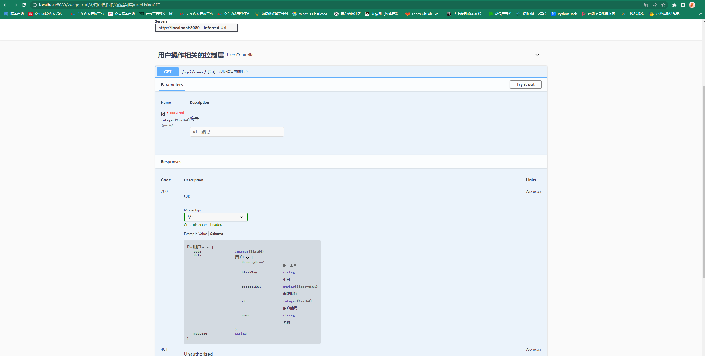

# 集成Swagger-UI实现在线API文档

> 本文主要讲解SpringBoot项目整合wagger-UI实现在线API文档,方便API的及时调用

## 简介

### Springfox

是一个开源的API Doc的框架， 它的前身是swagger-springmvc，可以将我们的Controller中的方法以文档的形式展现。官方定义为： Automated JSON API documentation for API's built with Spring。

### Swagger

Swagger 是围绕 OpenAPI 规范构建的一组开源工具，可以帮助您设计、构建、记录和使用 REST API。斯Swagger 格的主要工具包括:

+ 基于浏览器的编辑器，您可以在其中编写 OpenAPI 定义
+  将 OpenAPI 定义作为交互式文档呈现
+  从 OpenAPI 定义生成服务器存根和客户端库

### OpenAPI

OpenAPI 规范(以前称为 Swagger 规范)是针对 REST API 的 API 描述格式。OpenAPI 文件允许你描述你的整个 API，包括:

+ 可用端点(`/users`)和每个端点上的操作((`GET /users`, `POST /users`)
+ 操作参数每个操作的输入和输出
+ 认证方法
+ 联系方式、许可证、使用条款等信息。

API 规范可以用 YAML 或 JSON 编写。这种格式易于学习，并且对人类和机器都具有可读性。完整的 OpenAPI 规范可以在 GitHub 上找到: OpenAPI 3.0规范

## 选型因素

- 首先、使前端和后端更加解耦，前后端的对接通常是API形式，而后端开发人员在开发的过程中，提供的API和描述文档却是难以同步的，往往是开发代码完成了，但文档描述并不及时，甚至会忘记这一环节，导致前端调用API时经常发生错误，因此，springfox应运而生，它将前后端有效分离，并保证了API与文档的实时同步；

- 其次、使用springfox生成的接口文档直观可视，也帮助后端开发人员脱离了写接口文档的痛苦，及避免不厌其烦的解说各个接口需要的参数和返回结果；

- 再次、springfox支持在线测试，可实时检查参数和返回值。

## 搭建

### 引入Maven依赖

~~~xml
            <dependency>
                <groupId>io.springfox</groupId>
                <artifactId>springfox-boot-starter</artifactId>
                <version>3.0.0</version>
            </dependency>
~~~

### 项目配置

> Springfox Swagger2 配置：`config/SwaggerConfig.java`

~~~java
package com.dbq.arch.study.config;

import org.springframework.context.annotation.Bean;
import org.springframework.context.annotation.Configuration;
import springfox.documentation.builders.ApiInfoBuilder;
import springfox.documentation.service.ApiInfo;
import springfox.documentation.service.Contact;
import springfox.documentation.spi.DocumentationType;
import springfox.documentation.spring.web.plugins.Docket;

import java.util.function.Predicate;

import static springfox.documentation.builders.PathSelectors.regex;

@Configuration
public class SwaggerConfig {

    @Bean
    public Docket docket() {
        return new Docket(DocumentationType.OAS_30)
                .apiInfo(apiInfo())
                .select()
                // 匹配路径
                .paths(petstorePaths())
                .build();
    }

    /**
     * 只扫描指定路径
     *
     * @return
     */
    private Predicate<String> petstorePaths() {
        return regex(".*/api/.*");
    }

    private ApiInfo apiInfo() {
        return new ApiInfoBuilder()
                .title("Springfox petstore API")
                .description("Lorem Ipsum is simply dummy text of the printing and typesetting industry. Lorem Ipsum " +
                        "has been the industry's standard dummy text ever since the 1500s, when an unknown printer "
                        + "took a " +
                        "galley of type and scrambled it to make a type specimen book. It has survived not only five " +
                        "centuries, but also the leap into electronic typesetting, remaining essentially unchanged. " +
                        "It was popularised in the 1960s with the release of Letraset sheets containing Lorem Ipsum " +
                        "passages, and more recently with desktop publishing software like Aldus PageMaker including " +
                        "versions of Lorem Ipsum.")
                .termsOfServiceUrl("http://springfox.io")
                .contact(new Contact("springfox", "", ""))
                .license("Apache License Version 2.0")
                .licenseUrl("https://github.com/springfox/springfox/blob/master/LICENSE")
                .version("2.0")
                .build();
    }

}

~~~

### 请求类DTO配置 

~~~java
package com.dbq.arch.study.dto.req;

import io.swagger.annotations.ApiModel;
import io.swagger.annotations.ApiModelProperty;
import lombok.Data;

import java.io.Serializable;

/**
 * @author xq
 */
@Data
@ApiModel(value = "创建用户请求类")
public class MallUserReqDTO implements Serializable {

    /**
     * 名称
     *
     * @mbggenerated
     */
    @ApiModelProperty(value = "用户名称", example = "xq")
    private String name;

    /**
     * 生日
     *
     * @mbggenerated
     */
    @ApiModelProperty(value = "用户生日", example = "1995116")
    private String birthDay;
}

~~~

### 响应类DTO配置

~~~java
package com.dbq.arch.study.dto.res;

import io.swagger.annotations.ApiModel;
import io.swagger.annotations.ApiModelProperty;
import lombok.Data;

import java.util.Date;

/**
 * @author xq
 */
@ApiModel(value = "用户",description = "用户属性")
@Data
public class MallUserResDTO {

    @ApiModelProperty(value = "用户编号")
    private Long id;

    /**
     * 名称
     *
     * @mbggenerated
     */
    @ApiModelProperty(value = "名称")
    private String name;

    /**
     * 生日
     *
     * @mbggenerated
     */
    @ApiModelProperty(value = "生日")
    private String birthDay;

    /**
     * 创建时间
     *
     * @mbggenerated
     */
    @ApiModelProperty(value = "创建时间")
    private Date createTime;
}

~~~

### Controller层配置

~~~java
package com.dbq.arch.study.controller;

import com.dbq.arch.study.common.CommonPage;
import com.dbq.arch.study.common.R;
import com.dbq.arch.study.dto.req.MallUserReqDTO;
import com.dbq.arch.study.dto.res.MallUserResDTO;
import com.dbq.arch.study.mall.model.MallUser;
import com.dbq.arch.study.service.UserService;
import io.swagger.annotations.Api;
import io.swagger.annotations.ApiOperation;
import io.swagger.annotations.ApiParam;
import lombok.extern.slf4j.Slf4j;
import org.springframework.web.bind.annotation.*;

import javax.annotation.Resource;
import java.util.List;

/**
 * @author xq
 */
@Slf4j
@RequestMapping(value = "/api/user")
@RestController
@Api(tags = "用户操作相关的控制层")
public class UserController {

    @Resource
    UserService userService;

    /**
     * createUser
     *
     * @param req
     * @return
     */
    @PostMapping(value = "/create")
    @ApiOperation(value = "用户注册", httpMethod = "POST")
    public R createUser(@ApiParam(name = "用户", value = "注册的用户信息") @RequestBody MallUserReqDTO req) {
        R r;
        MallUser mallUser = new MallUser();
        mallUser.setName(req.getName());
        mallUser.setBirthDay(req.getBirthDay());
        int count = userService.createUser(mallUser);
        if (count == 1) {
            r = R.success(mallUser);
            log.debug("createBrand success:{}", mallUser);
        } else {
            r = R.failed("操作失败");
            log.debug("createBrand failed:{}", mallUser);
        }
        return r;

    }

    /**
     * user
     *
     * @param id
     * @return
     */
    @ApiOperation(value = "根据编号查询用户", httpMethod = "GET")
    @GetMapping(value = "/{id}")
    public R<MallUserResDTO> user(@ApiParam(value = "编号", name = "id" , required = true) @PathVariable("id") Long id) {
        MallUser user = userService.getUser(id);
        if (user == null) {
            log.warn("没有此用户");
            R.failed("没有此用户");
        }
        MallUserResDTO mallUserResDTO = new MallUserResDTO();
        mallUserResDTO.setId(user.getId());
        mallUserResDTO.setName(user.getName());
        mallUserResDTO.setBirthDay(user.getBirthDay());
        mallUserResDTO.setCreateTime(user.getCreateTime());
        return R.success(mallUserResDTO);

    }

}

~~~

### 配置注解说明

@ApiOperation

>使用于在方法上，表示一个http请求的操作
>源码中属性太多，记几个比较常用
>value用于方法描述
>notes用于提示内容
>tags可以重新分组（视情况而用）

@ApiParam

>使用在方法上或者参数上，字段说明；表示对参数的添加元数据（说明或是否必填等）
>name–参数名
>value–参数说明
>required–是否必填

@ApiModel()
>使用在类上，表示对类进行说明，用于参数用实体类接收
>value–表示对象名
>description–描述

@ApiModelProperty()
>使用在方法，字段上，表示对model属性的说明或者数据操作更改
>value–字段说明
>name–重写属性名字
>dataType–重写属性类型
>required–是否必填
>example–举例说明
>hidden–隐藏

### 效果

## 项目源码地址
[http://gitlab.wn/common/arch-study.git](http://gitlab.wn/common/arch-study.git)

## 引用

>https://github.com/OAI/OpenAPI-Specification/blob/main/versions/3.0.3.md
>
>[https://swagger.io/docs/specification/basic-structure/](https://github.com/OAI/OpenAPI-Specification/blob/main/versions/3.0.3.md)
>
>https://swagger.io/tools/open-source/open-source-integrations/
>
>http://springfox.github.io/springfox/docs/current/#swagger
>
>https://github.com/springfox/springfox-demos
>
>https://mp.weixin.qq.com/s/0-c0MAgtyOeKx6qzmdUG0w?spm=a2c6h.12873639.article-detail.7.5215604eDYlPma
>
>https://doc.xiaominfo.com/docs/quick-start
